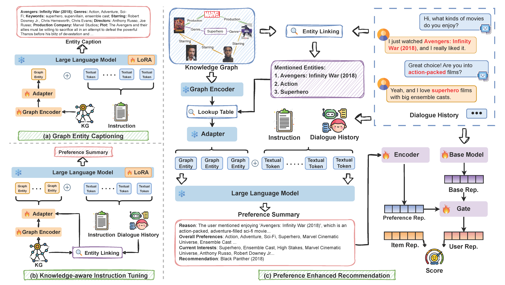

# COMPASS

Official Implementation of
**Reasoning over User Preferences: Knowledge Graph‑Augmented LLMs for Explainable Conversational Recommendations**



## Installation

Follow these steps to set up the environment:

1. **Create a Conda Environment**

   Use the provided `environment.yml` file to create and activate the Conda environment:

   ```bash
   conda env create -f environment.yml
   conda activate compass
   ```

2. **Set up Hugging Face Token**

   Add your Hugging Face token to a .env file. Ensure you have accepted the license agreements for the required model. Visit the Hugging Face website to review and accept the agreements.

   ```bash
   HUGGINGFACE_API_KEY=<your_huggingface_token>
   ```

## Quick-Start

To train the COMPASS model, run the following command:

   ```bash
   python main.py
   ```

You can specify dataset, models in the `config/default.yaml` file.

- Dataset-specific configurations can be found in the `config/dataset/` folder.
- Model-specific configurations can be found in the `config/model/` folder.

### Enhancement

Once training is complete, copy the generated user preference summary folder to: `data/<dataset_name>/preprocessed/llm_outputs/compass/` folder.

Then update the `config/default.yaml` file with the baseline model name and run the following command:

   ```bash
   python main.py
   ```

## Citation

```bibtex
@INPROCEEDINGS{11393682,
  author={Qiu, Zhangchi and Luo, Linhao and Pan, Shirui and Liew, Alan Wee-Chung},
  booktitle={2025 IEEE International Conference on Data Mining (ICDM)}, 
  title={Reasoning Over User Preferences: Knowledge Graph-Augmented LLMs for Explainable Conversational Recommendations}, 
  year={2025},
  volume={},
  number={},
  pages={1495-1504},
  keywords={Large language models;Natural languages;Transforms;Knowledge graphs;Benchmark testing;Cognition;Vectors;User preference;Compass;Recommender systems;Conversational Recommender System;Large Language Model;Knowledge Graph;Explainable Recommendation},
  doi={10.1109/ICDM65498.2025.00159}}

}
```
