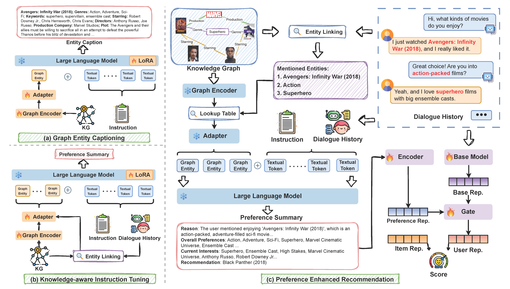

# COMPASS

Official Implementation of
**Unveiling User Preferences: A Knowledge Graph and LLM-Driven Approach for Conversational Recommendation**



## Installation

Follow these steps to set up the environment:

1. **Create a Conda Environment**

   Use the provided `environment.yml` file to create and activate the Conda environment:

   ```bash
   conda env create -f environment.yml
   conda activate compass
   ```

2. **Set up Hugging Face Token**

   Add your Hugging Face token to a .env file. Ensure you have accepted the license agreements for the required model. Visit the Hugging Face website to review and accept the agreements.

   ```bash
   HUGGINGFACE_API_KEY=<your_huggingface_token>
   ```

## Quick-Start

To train the COMPASS model, run the following command:

   ```bash
   python main.py
   ```

You can specify dataset, models in the `config/default.yaml` file.

- Dataset-specific configurations can be found in the `config/dataset/` folder.
- Model-specific configurations can be found in the `config/model/` folder.

### Enhancement

Once training is complete, copy the generated user preference summary folder to: `data/<dataset_name>/preprocessed/llm_outputs/compass/` folder.

Then update the `config/default.yaml` file with the baseline model name and run the following command:

   ```bash
   python main.py
   ```
